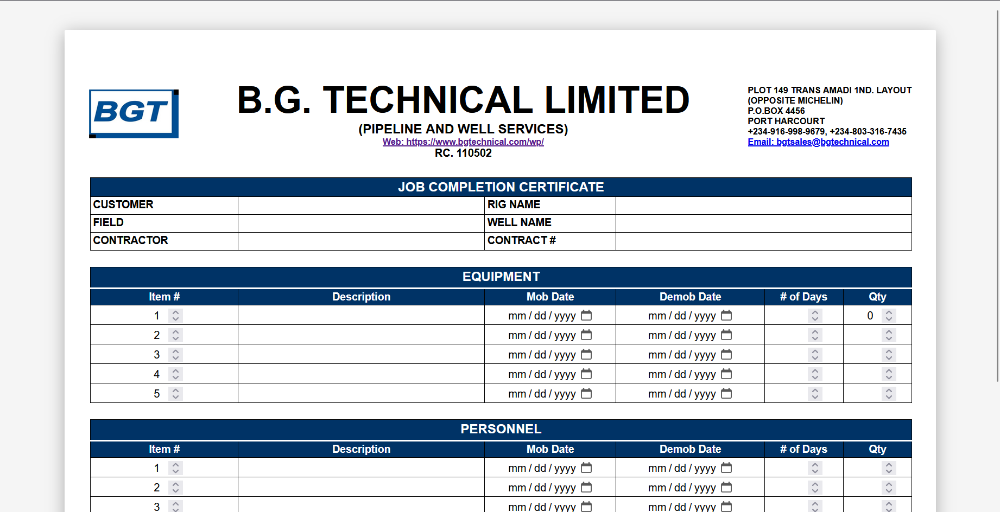
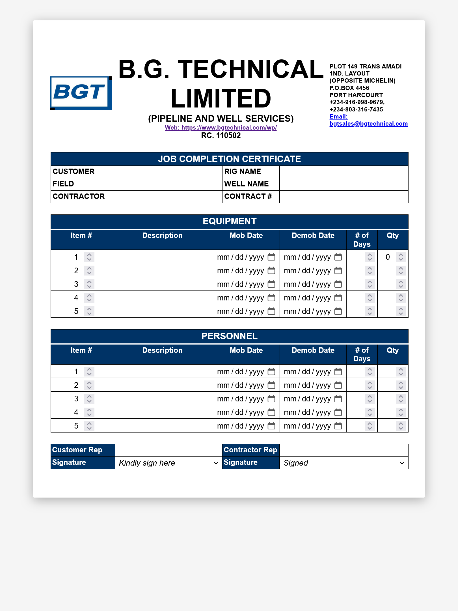
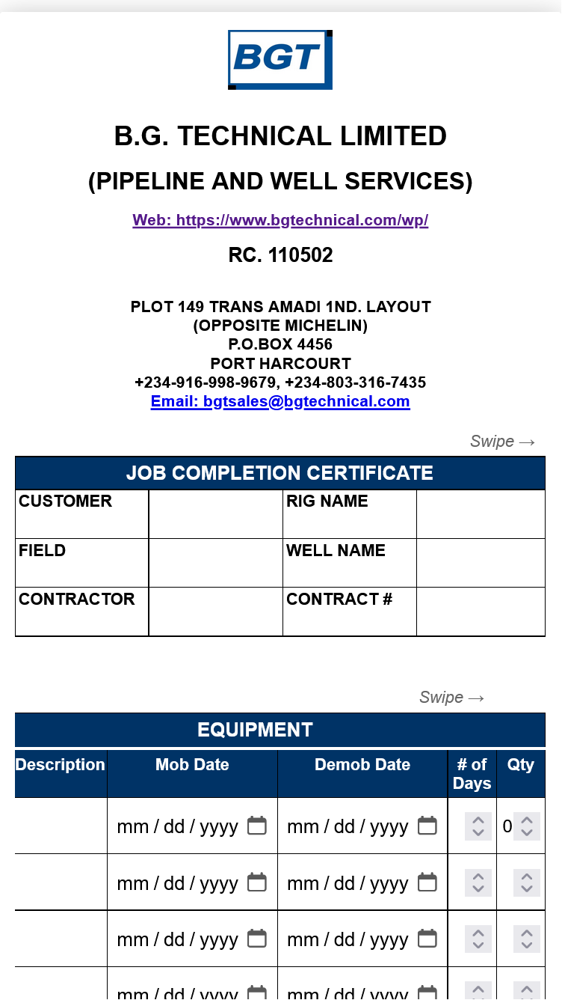

# Job Completion Certificate

A responsive, print-friendly \*\*Job Completion Certificate\*\* built using pure \*\*HTML and CSS\*\*.

This project replicates a real-world corporate job completion form with structured tables, editable fields, and signature sections.

The layout is optimized for desktop, tablet, and mobile screens using CSS media queries, with no JavaScript required.

- Clean certificate-style layout  
- Editable input fields for:
  - Customer & job details
  - Equipment records
  - Personnel records
- Structured tables with consistent column alignment
- Signature and approval section
- Fully responsive design (Desktop, Tablet, Mobile)
- Mobile-friendly horizontal table scrolling with swipe hint
- Print-friendly styling
- Built with **HTML5 & CSS3 only**


---


## 📸 Screenshots

### Desktop View
> Full-width layout with tables fully visible


### Tablet View


### Mobile View
Horizontal scrolling enabled for wide tables with swipe hint



---


## 📁 Project Structure

├── table.html # Main HTML file
├── styles.css # Styling and responsiveness
├── LOGO.png # Company logo (replace as needed)
├── screenshots/
│ ├── desktop.png
│ ├── tablet-view.png
│ └── mobile-view.png


---


## 🚀 How to Use

1. Clone the repository:
   ```bash
   git clone https://github.com/your-username/job-completion-certificate.git

2. Open table.html in any modern web browser.

3. Replace:

• Logo image
• Company details
• Text fields as required


📱 Responsiveness

• Desktop: Full table layout with no overflow
• Tablet (≤ 768px): Optimized spacing and layout
• Mobile (≤ 480px):

    • Tables scroll horizontally
    • Subtle swipe hint guides user interaction
    • Content remains readable without breaking layout

🛠️ Technologies Used

• HTML5
• CSS (Flexbox & Media Queries)

📌 Notes

• No JavaScript used
• Ideal for internal documentation, job reporting, or certificate-style forms
• Can be extended with JavaScript or backend integration if needed


📄 License

This project is open for learning and customization.